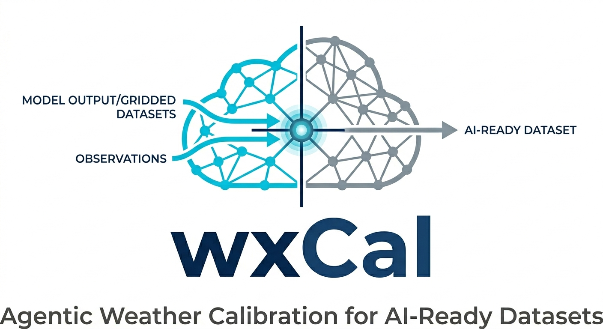
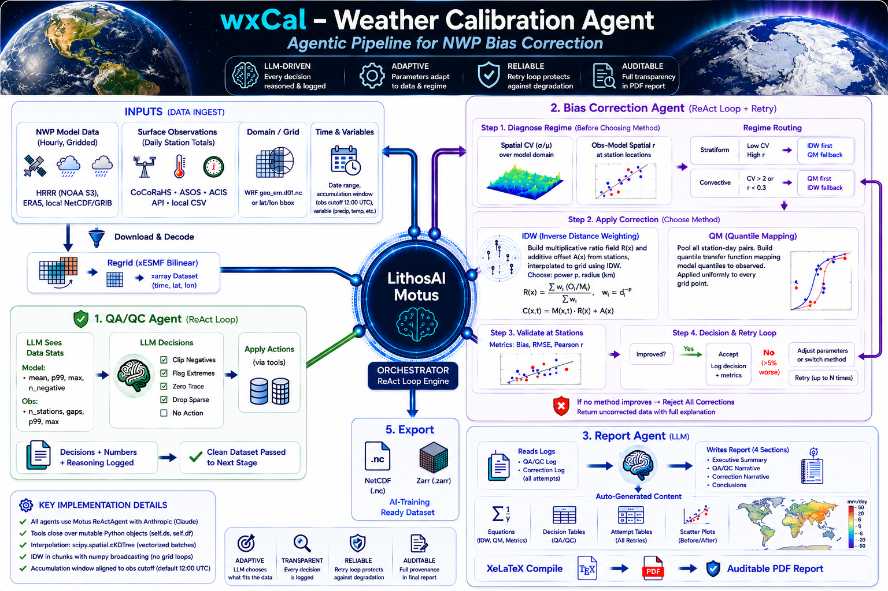

# wxCal — Weather Calibration Agent

**wxCal** is an agentic pipeline that bias-corrects numerical weather prediction (NWP) and AI-based model output against surface observations, then produces a transparent, publication-ready PDF report documenting every decision made.

> **Motus use case** — wxCal is built entirely on [LithosAI Motus](https://motus.lithosai.com), demonstrating how Motus `ReActAgent` loops can replace hand-coded correction logic with autonomous agents that reason, act, validate, and self-correct.

---

## Workflow



The pipeline runs six stages in sequence:

| Stage | What happens |
|---|---|
| **Ingest** | Downloads HRRR hourly GRIB2 from the NOAA public S3 bucket (or reads a local file) |
| **Regrid** | Reprojects onto the target grid — either a WRF `geo_em` domain or a lat/lon bounding box |
| **Observations** | Fetches daily station data from the NOAA ACIS multi-network API or a local CSV |
| **QA/QC Agent** | LLM inspects data statistics, decides thresholds, flags/clips/drops, logs every decision |
| **Correction Agent** | LLM diagnoses precipitation regime, selects and applies IDW or Quantile Mapping, validates, retries or rejects |
| **Report Agent** | LLM writes a full narrative; Python generates comparison maps and scatter plots; XeLaTeX compiles a PDF |

---

## The Motus Agent Layer

wxCal replaces traditional hard-coded correction scripts with three autonomous agents, each built on a **Motus `ReActAgent`** loop:

```
Reason → Call tool → Observe result → Decide next step → repeat
```

Each agent receives statistical summaries (never raw arrays), calls Python functions via the `@tool` decorator, and logs every decision for the report.

### QA/QC Agent

Inspects model grid statistics and observation distributions. Decides whether to clip negatives, flag extremes, zero sub-instrument trace values, or drop sparse stations — with explicit written reasoning for every choice. If the data is already clean, it records that too.

### Bias Correction Agent

1. **Diagnoses the precipitation regime** — computes spatial coefficient of variation (CV) and obs–model spatial correlation per day to classify as *convective* or *stratiform*
2. **Selects a method** — IDW for stratiform (spatially coherent bias), Quantile Mapping for convective (distribution correction robust to phase errors)
3. **Applies, validates, and retries** — if RMSE degrades > 5%, switches to the alternative method; rejects all corrections if neither improves the baseline
4. **Reports honestly** — if correction is harmful, returns uncorrected data and explains why

### Report Agent

Receives all decision logs, writes four narrative sections (executive summary, QA/QC narrative, correction narrative, conclusions) with specific numbers cited throughout. Python generates spatial comparison maps (before / after / difference) and obs-vs-model scatter plots. XeLaTeX compiles the final PDF.

---

## Installation

### Prerequisites

| Requirement | Version | Notes |
|---|---|---|
| Python | 3.12 – 3.13 | 3.14 not yet supported |
| [uv](https://docs.astral.sh/uv/) | latest | Recommended package manager (`pip install uv`) |
| [XeLaTeX](https://tug.org/xetex/) | any recent | Required for PDF report compilation |
| conda (optional) | any | Needed only for `xesmf` regridding on macOS ARM |

Install XeLaTeX via your OS package manager:
```bash
# macOS
brew install --cask mactex-no-gui   # or: brew install basictex

# Ubuntu / Debian
sudo apt install texlive-xetex texlive-fonts-recommended
```

### Python packages

All Python dependencies are declared in `pyproject.toml` and installed in one step:

```bash
git clone https://github.com/demetresfytanides/wxcal.git
cd wxcal
uv sync
```

| Package | Purpose |
|---|---|
| [`lithosai-motus`](https://pypi.org/project/lithosai-motus/) | Agent orchestration framework — `ReActAgent`, `@tool`, cloud deploy |
| [`anthropic`](https://pypi.org/project/anthropic/) | Anthropic SDK used by Motus `AnthropicChatClient` |
| [`xarray`](https://xarray.pydata.org) | Gridded NetCDF / Zarr model data |
| [`numpy`](https://numpy.org) | Array operations throughout the pipeline |
| [`scipy`](https://scipy.org) | `cKDTree` nearest-neighbour lookup, quantile functions |
| [`pandas`](https://pandas.pydata.org) | Observation DataFrames |
| [`netCDF4`](https://unidata.github.io/netcdf4-python/) | NetCDF read/write backend |
| [`zarr`](https://zarr.readthedocs.io) | Optional Zarr output format |
| [`cfgrib`](https://github.com/ecmwf/cfgrib) | GRIB2 decoding for HRRR files |
| [`eccodes`](https://pypi.org/project/eccodes/) | ECMWF GRIB codec (cfgrib backend) |
| [`ecmwflibs`](https://pypi.org/project/ecmwflibs/) | Pre-built ECMWF native libraries |
| [`matplotlib`](https://matplotlib.org) | Spatial maps and scatter plots |
| [`geopandas`](https://geopandas.org) | Geospatial utilities |
| [`imageio`](https://imageio.readthedocs.io) | Animated GIF generation |
| [`pillow`](https://python-pillow.org) | Image processing |
| [`requests`](https://requests.readthedocs.io) | NOAA ACIS API calls |
| [`tqdm`](https://tqdm.github.io) | Download progress bars |
| [`python-dotenv`](https://pypi.org/project/python-dotenv/) | Loads `.env` API keys |

#### Optional: xesmf (faster regridding)

[xesmf](https://xesmf.readthedocs.io) provides conservative regridding and is recommended for production runs. It must be installed via conda on macOS ARM:

```bash
conda install -c conda-forge xesmf esmf
```

wxCal automatically falls back to `scipy` nearest-neighbour interpolation if xesmf is unavailable.

### API keys and accounts

wxCal requires an LLM API key for the three agents. Choose one backend:

**Option A — Direct Anthropic API (local runs)**

1. Create an account at [console.anthropic.com](https://console.anthropic.com)
2. Generate an API key under *API Keys*
3. Add to your `.env`:
   ```
   ANTHROPIC_API_KEY=sk-ant-...
   ```

**Option B — LithosAI Motus Cloud (production / sharing)**

1. Install the Motus CLI: `uv tool install lithosai-motus`
2. Log in: `motus login`
3. Deploy: `motus deploy --name wxcal wxcal_serve:wxcal_agent`

   API keys are injected automatically on Motus Cloud — no `.env` needed there.
   Subsequent deploys read `motus.toml` automatically: just run `motus deploy`.

**Option C — OpenRouter (any model, local)**

1. Create an account at [openrouter.ai](https://openrouter.ai)
2. Add to your `.env`:
   ```
   MOTUS_CLOUD=1
   OPENAI_API_KEY=sk-or-...
   ```

---

## Deploying to LithosAI Motus Cloud

wxCal can be served as a cloud agent on [LithosAI Motus](https://motus.lithosai.com). Two additions to the codebase make this work:

### 1. `wxcal_serve.py` — Motus serve entry point

The core pipeline (`orchestrator.py:run`) is a batch function, not a conversational agent. `wxcal_serve.py` wraps it in a `ReActAgent` that conforms to the Motus serve contract:

- Exposes a single `@tool` — `run_wxcal_pipeline` — with all pipeline parameters as typed arguments
- The agent LLM parses the user's natural-language request, fills the parameters, and calls the tool
- The tool constructs a `WxCalConfig`, runs the full pipeline, and returns a dict with output paths

```python
# The deployed entry point
wxcal_agent = ReActAgent(
    client=...,
    tools=[run_wxcal_pipeline],
    system_prompt=...,
)
```

### 2. `utils/client.py` — LLM client selector

On Motus Cloud the platform injects its own OpenRouter proxy (`OPENAI_BASE_URL` + `OPENAI_API_KEY`) automatically. `make_client()` detects this and switches all three internal agents (QA/QC, correction, report) from `AnthropicChatClient` to `OpenAIChatClient` — no code changes needed between local and cloud runs, and your personal `ANTHROPIC_API_KEY` is never uploaded.

```
Local:   ANTHROPIC_API_KEY set  →  AnthropicChatClient  →  Anthropic direct
Cloud:   OPENAI_BASE_URL  set   →  OpenAIChatClient     →  Motus/OpenRouter proxy
```

### Deploy steps

```bash
# First deploy (creates the cloud project)
uv tool install lithosai-motus   # install CLI if needed
motus login
motus deploy --name wxcal wxcal_serve:wxcal_agent

# Subsequent deploys (project ID stored in motus.toml)
motus deploy
```

### Interact with the deployed agent

After deploying, Motus prints the agent endpoint URL. Use it to send requests:

```bash
# Single message
motus serve chat <AGENT_ENDPOINT_URL> \
  "Run wxCal for 2024-06-01 to 2024-06-03, bbox 41.0 43.5 -89.0 -86.0, precipitation"

# Interactive REPL
motus serve chat <AGENT_ENDPOINT_URL>
```

> **Note on output files:** The corrected NetCDF and PDF are written to the container's local filesystem and the paths are returned in the agent's response. For production use with external consumers, add S3/GCS upload to `run_wxcal_pipeline` and return presigned download URLs.

---

## Quickstart

```bash
# Clone and install
git clone https://github.com/your-org/wxcal.git
cd wxcal
uv sync

# Configure API key
cp .env.example .env
# Edit .env and add your ANTHROPIC_API_KEY

# Run over a bounding box
python orchestrator.py \
    --model hrrr \
    --obs   acis \
    --bbox  41.0 43.5 -89.0 -86.0 \
    --start 2024-06-01 \
    --end   2024-06-03 \
    --var   precipitation

# Run using a WRF geo_em domain file
python orchestrator.py \
    --model hrrr \
    --obs   acis \
    --geo   /path/to/geo_em.d01.nc \
    --start 2024-06-01 \
    --end   2024-06-03 \
    --var   precipitation
```

Outputs land in `data/output/`:
- `wxcal_precipitation_YYYYMMDD_YYYYMMDD_corrected.nc` — bias-corrected NetCDF
- `wxcal_report_YYYYMMDD_YYYYMMDD.pdf` — full transparency report

---

## CLI Reference

```
python orchestrator.py [options]

Time range:
  --start YYYY-MM-DD        Start date (required)
  --end   YYYY-MM-DD        End date (required)

Domain (choose one):
  --geo   PATH              WRF geo_em.d01.nc file
  --bbox  LAT_MIN LAT_MAX LON_MIN LON_MAX
  --dx    KM                Grid spacing when using --bbox (default: 3 km)

Sources:
  --model hrrr|era5|PATH    Model source (default: hrrr)
  --obs   acis|PATH         Observation source (default: acis)
  --var   precipitation|temperature|wind_u|wind_v

Accumulation:
  --obs-cutoff HOUR         UTC hour obs accumulation ends (default: 12 = CoCoRaHS 7am CDT)

Output:
  --outdir  PATH            Base output directory (default: data/)
  --format  netcdf|zarr|both

Agent:
  --llm     MODEL           LLM model string (default: claude-sonnet-4-6)
  --retries N               Max correction retries (default: 3)
  --workers N               Parallel download threads (default: 4)
```

---

## Environment

| Variable | Purpose |
|---|---|
| `ANTHROPIC_API_KEY` | Direct Anthropic API (local runs) |
| `MOTUS_CLOUD=1` | Route LLM calls through Motus Cloud / OpenRouter |
| `OPENAI_API_KEY` | OpenRouter key (when `MOTUS_CLOUD=1`) |

On Motus Cloud, `OPENAI_API_KEY` and `OPENAI_BASE_URL` are injected automatically — no configuration needed.

---

## Correction Methods

### IDW — Inverse Distance Weighting

Builds a spatially-varying multiplicative ratio field from station observations and applies it to every model grid point. Best for stratiform precipitation and temperature where the bias is spatially coherent.

### Quantile Mapping

Maps the model precipitation distribution to the observed distribution by constructing a piecewise-linear quantile transfer function from all station-day pairs. Applied uniformly across the grid. Best for convective precipitation where phase errors make spatially-varying corrections unreliable.

### Regime Diagnosis

Before correction, the agent computes:
- **CV** (spatial coefficient of variation of daily model precipitation)
- **r** (Pearson correlation between station observations and nearest-neighbour model values)

| CV > 2 or r < 0.3 | → Convective → Quantile Mapping first |
|---|---|
| Otherwise | → Stratiform → IDW first |

If the first method degrades RMSE by more than 5%, the agent falls back to the other. If neither improves the baseline, the correction is rejected and uncorrected data is returned.

---

## Observation Accumulation Window

CoCoRaHS and ACIS observers read gauges at approximately 7 am local time — 12:00 UTC in Central Daylight Time. An observation labelled date *D* represents the 24-hour window `[D-1 12:00 UTC, D 12:00 UTC)`. wxCal sums model hourly fields over that same window (`--obs-cutoff 12`) to avoid the 12-hour phase offset that would otherwise degrade spatial correlation for convective events.

---

## Stack

| Component | Role |
|---|---|
| [LithosAI Motus](https://motus.lithosai.com) | Agent orchestration (`ReActAgent`, `@tool`, cloud deploy) |
| [Anthropic Claude](https://anthropic.com) | LLM backbone for all three agents |
| [xarray](https://xarray.pydata.org) | Gridded model data (NetCDF / Zarr) |
| [scipy](https://scipy.org) | `cKDTree` nearest-neighbour, quantile functions |
| [NOAA HRRR S3](https://registry.opendata.aws/noaa-hrrr-pds/) | Public model archive |
| [NOAA ACIS API](https://www.rcc-acis.org) | Multi-network station observations |
| [XeLaTeX](https://tug.org/xetex/) | PDF report compilation |
| [matplotlib](https://matplotlib.org) | Spatial maps and scatter plots |

---

## Project Structure

```
wxcal/
├── orchestrator.py          # Pipeline entry point
├── config.py                # WxCalConfig dataclass
├── agents/
│   ├── qaqc_agent.py        # QA/QC ReActAgent
│   ├── correction_agent.py  # Bias correction ReActAgent
│   └── report_agent.py      # Report ReActAgent + LaTeX builder
├── tools/
│   ├── ingest.py            # HRRR / ERA5 / local file loader
│   ├── observations.py      # ACIS API + CSV loader
│   ├── regrid.py            # xESMF / scipy reprojection
│   ├── correct.py           # IDW + Quantile Mapping engines
│   ├── validate.py          # Bias / RMSE / correlation metrics
│   ├── qaqc.py              # QA/QC operations
│   └── export.py            # NetCDF / Zarr writer
├── utils/
│   ├── client.py            # Motus client selector (Anthropic vs OpenRouter)
│   ├── accumulation.py      # Obs accumulation window helper
│   └── geo.py               # Coordinate utilities
└── assets/
    ├── logo.png
    └── workflow_v2.png
```

---

## License

MIT
